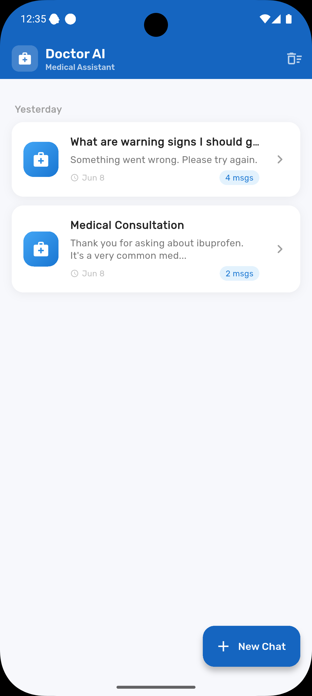
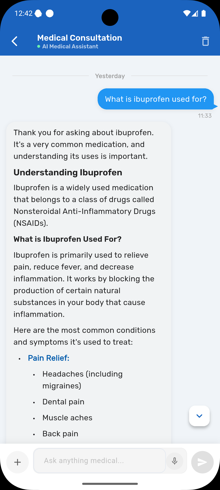
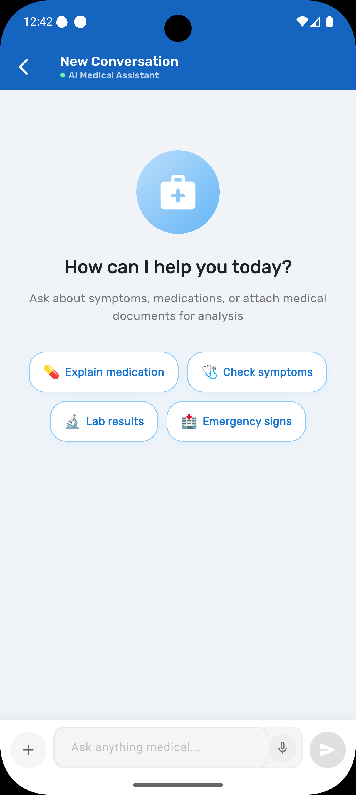
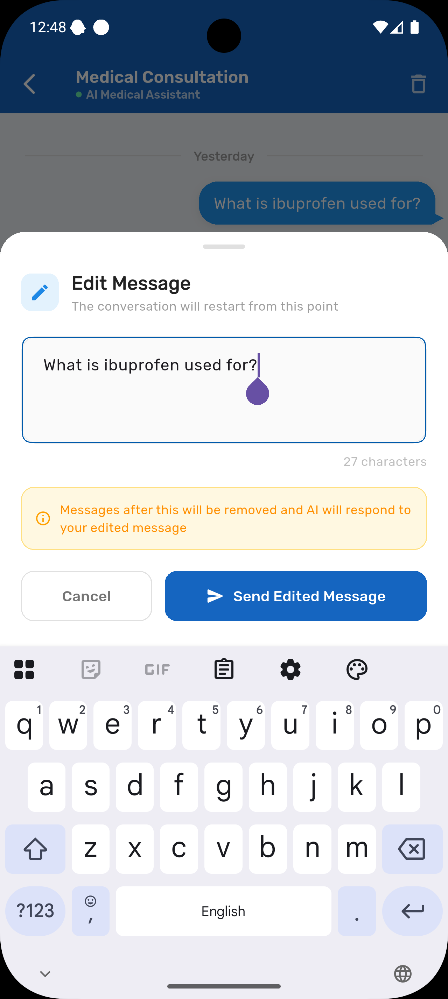
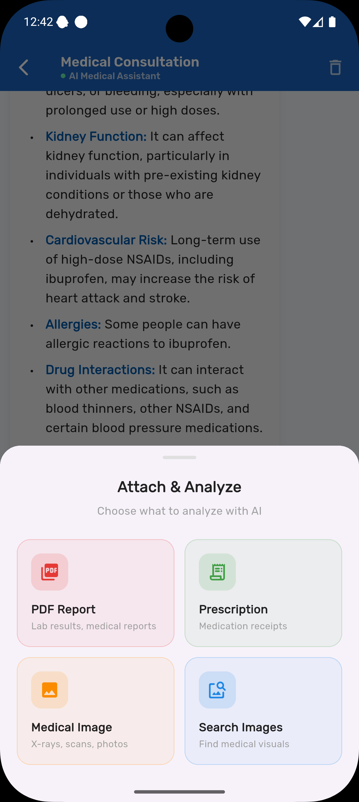
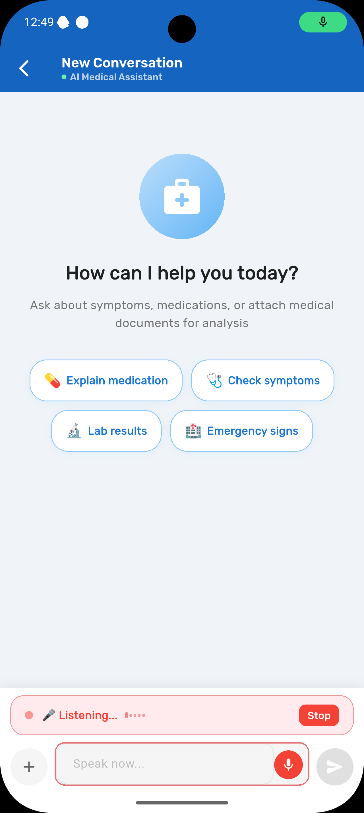

# 🏥 Doctor AI — Smart Medical Assistant

**An intelligent medical assistant powered by Google Gemini AI**

---

## 📱 Screenshots

| Sessions | Chat | Analysis |
|----------|------|----------|
|  |  |  |

| Edit Message | Prescription | Speech Input |
|-------------|-------------|--------------|
|  |  |  |

---

## ✨ Features

### 🤖 AI-Powered Chat
- Conversational medical assistant using **Google Gemini 2.5 Flash**
- Markdown-formatted responses with headings, lists, and warnings
- Real-time **streaming** responses with typing animation
- **RAG (Retrieval-Augmented Generation)** — references your past conversations for personalized answers

### 🎙️ Speech to Text
- Tap the microphone and speak your question
- Real-time sound level visualization
- Supports long voice inputs (up to 2 minutes)
- Works in English and arabic(expandable to other languages)

### 📄 Document Analysis
| Type | Description |
|------|-------------|
| 📋 PDF Reports | Lab results, medical reports, discharge summaries |
| 🧾 Prescriptions | Camera or gallery capture with medication explanation |
| 🖼️ Medical Images | X-rays, scans, skin photos — visual AI analysis |

### 🔍 OCR (Text Extraction)
- Automatic text extraction from images using **Google ML Kit**
- OCR text is passed alongside the image to Gemini for deeper analysis
- Works offline — no internet required for text extraction

### 💬 Chat Management
- **Edit messages** — modify and resend with full context reset
- **Delete messages** — remove individual messages
- **Re-analyze** — ask AI to re-examine any response
- **Copy** — one-tap copy any message to clipboard

### 🗂️ Chat History (Memory)
- All conversations saved locally using **Hive** database
- Browse past conversations grouped by Today / Yesterday / Earlier
- Auto-generated conversation titles from first message
- Swipe to delete sessions
- Persistent across app restarts

### 🔍 Medical Image Search
- Search medical illustrations and anatomy images
- Grid gallery view with full-screen zoom
- Powered by Lexica Art API

---

## 🏗️ Architecture
lib/
├── features/
│ └── chat/
│ ├── data/
│ │ ├── chat_hive_adapters.dart # Hive serialization
│ │ ├── chat_storage_service.dart # Local persistence + RAG
│ │ └── ocr_service.dart # ML Kit OCR
│ ├── domain/
│ │ ├── chat_message.dart # Freezed model
│ │ └── chat_session.dart # Session model
│ └── presentation/
│ ├── controller/
│ │ └── chat_controller.dart # Riverpod state
│ ├── screens/
│ │ ├── sessions_screen.dart # Chat history
│ │ └── chat_screen.dart # Main chat UI
│ └── widgets/
│ ├── chat_bubble.dart # Message bubble
│ ├── chat_input_bar.dart # Input + mic + attach
│ └── image_gallery_sheet.dart
└── src/
├── core/
│ └── ai_services/
│ └── gemini_service.dart # Gemini API wrapper
└── infrastructure/
└── storage/
└── hive/
└── hive_initializer.dart # Hive setup

### Tech Stack

| Layer | Technology |
|-------|-----------|
| **UI** | Flutter + Material 3 |
| **State Management** | Riverpod 2.x + Riverpod Annotation |
| **AI** | Google Gemini 2.5 Flash |
| **Local Storage** | Hive (NoSQL) |
| **OCR** | Google ML Kit Text Recognition |
| **Models** | Freezed + JSON Serializable |
| **Speech** | speech_to_text |
| **File Handling** | file_picker + image_picker |